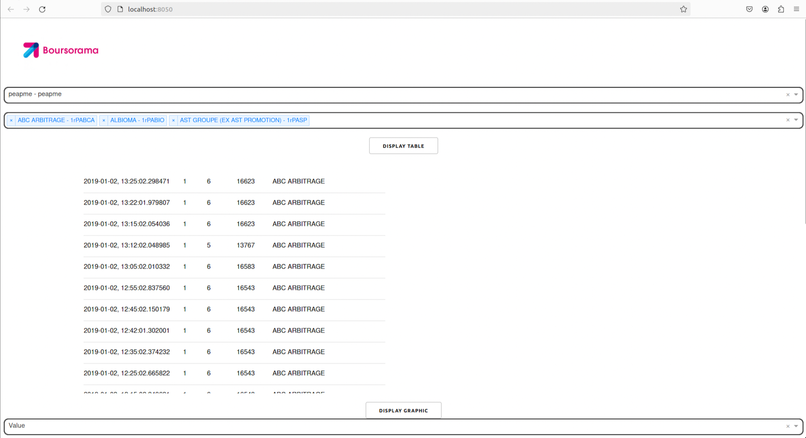
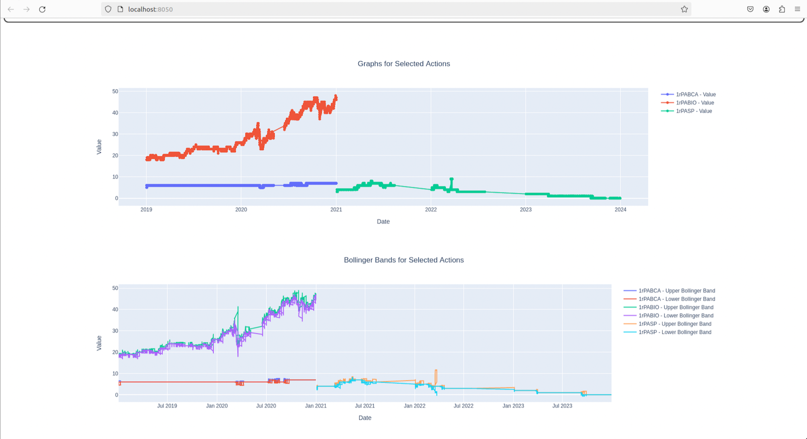

# Projet BigData

## 1. Lancement du projet :

### Étapes de préparation :
- Télécharger les données depuis Boursorama.
- Déplacer le fichier `boursorama.tar` vers le répertoire `/srv/libvirt-workdir` en utilisant la commande : mv boursorama.tar /srv/libvirt-workdir
- Aller dans le répertoire `/srv/libvirt-workdir` et décompresser le fichier `Boursorama.tar` avec la commande : tar -xf Boursorama.tar
- Supprimer le fichier `boursorama.tar`.
- Aller à la racine du projet et lancer la commande `make`. Cette commande va exécuter `make` dans les deux dossiers de Docker (analyzer et dashboard) puis exécuter `docker-compose up`.

## 2. Affichage du dashboard :
- Voici le resultat attendu grace aux images situées à la racine du projet:

### Utilisation du dashboard :
- Lancer le localhost du dashboard dans un navigateur en suivant le lien : `http://localhost:8050/`.
- Sélectionner un marché parmi la liste des marchés disponibles, par exemple "peapme".
- Choisir une ou plusieurs actions parmi celles disponibles dans le marché choisi.
- Cliquer sur "display table" pour afficher un tableau détaillé des actions sélectionnées, regroupées dans une seule dataframe. Faire défiler la barre de navigation du tableau pour voir toutes les données.
- Utiliser "display graphic" pour visualiser graphiquement les données. Cela comprend deux graphiques : un graphique basique de l'évolution de la valeur ou du volume des actions, et un graphique des bandes de Bollinger pour chaque action sélectionnée.

## 3. Gestion des problèmes :

### Analyzer :
- Filtrage des données après leur injection dans un dataframe :
- Suppression des "(c)" et "(s)" et des espaces dans le champ `last` et transformation en float.
- Suppression des jours fériés.
- Problèmes spécifiques à certains marchés :
- Pour le marché `peapme` :
  - Création du marché `peapme` pour les années 2021, 2022, 2023 dans le tableau des marchés.
  - Suppression des volumes excédant "2000000000".
- Pour le marché `amsterdam` :
  - Temps de filtrage excessivement lent. Solution : ne pas intégrer le marché dans la database.

## 4. Temps d'exécution :

- Temps d'exécution estimé : ~1 heure.